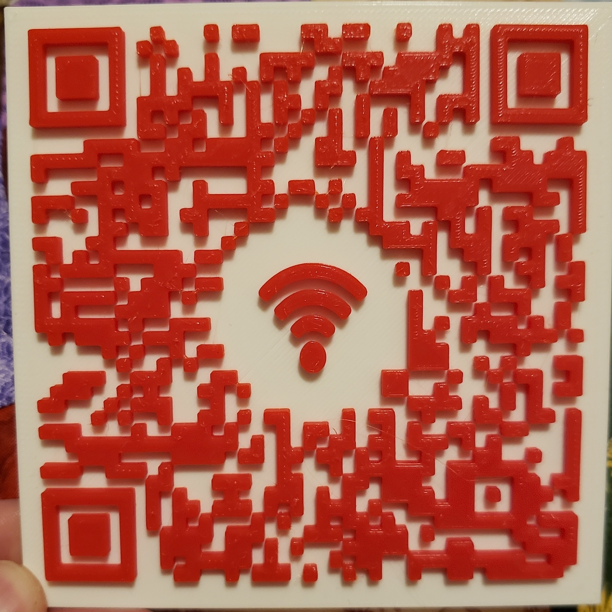

# QR Code STL Generator



## About

I wanted to print a QR code for home guests to be able to connect to my wifi without me having to write down the password for them. I couldn't find any STL generators for QR codes, so I decided to make one using Python and Blender.

While I designed this with Wifi and 3d printing in mind, you could change the icon to something like a website icon or logo and then insert a URL instead of Wifi credentials. Even if you don't have a printer, you can use the `files/qr.png` image that is generated and hang it up at home or hand it out. 

## Requirements

* [Python 3](https://www.python.org/)
    - `pip3 install -r requirements.txt`

* [Blender 2.8](https://www.blender.org/)

## Usage

### Setup

For the quickest setup, just put your Blender path and wifi information into `qr.py` with a text editor. If you want to configure the STL generation, use the following options:

* `qr.py`
    - `blender_path`: Path to blender program. On MacOS this is something like `/Applications/Blender.app/Contents/MacOS/Blender`. Defaults for other operating systems are in the script
    - `auth_type`: Wifi auth type, valid inputs are `WPA`, `WEP`, and empty
    - `ssid`: Name of your Wifi network    
    - `password`: Password for Wifi network. This all runs locally, but keep in mind that if someone can see your QR code they can also extract the password

* `qr_blend.py`
    - `svg_path`: Path to QR code SVG file, default is fine if you're using the built-in SVG generator
    - `icon_path`: Path to SVG of center icon
    - `output_path`: Where you want the resulting STL to go
    - `icon_radius`: How big to make space for the center icon, this should be small (0.005 - 0.02)
    - `qr_height`: Height in mm to make the 'black' part of the QR code
    - `icon_height`: Height in mm to make the icon
    - `base_height`: Height in mm to make the 'white' part of the QR code
    - `qr_length`: Length in mm of the code portion
    - `icon_length`: Length in mm of the center icon
    - `base_length`: Length in mm of the base

* In `qr_img.py`The amount of redundancy can be adjusted which allows for things such as icons and such. However, to reduce the density of the code this can be lowered if desired:
    - `ERROR_CORRECT_L`: About 7% or less errors can be corrected.
    - `ERROR_CORRECT_M`: About 15% or less errors can be corrected.
    - `ERROR_CORRECT_Q`: About 25% or less errors can be corrected.
    - `ERROR_CORRECT_H`: About 30% or less errors can be corrected.

The scripts have other things you can tweak if you wanna dig into it, and I may add more options if it turns out people want some more.

### Running

If all of the dependecies are installed correctly and the Blender path is correct, running is as simple as:

```
python3 qr.py
```

The STL will end up in the current directory by default. A PNG will also be generated at `files/qr.png`. 

### Printing

PrusaSlicer is what I use to slice my prints and it has a really cool feature that allows you to pause prints at a certain layer to change filaments. Simply import the STL, set the layer where you wanna swap, then the printer will pause at that layer and allow for a filament swap. I'm told that other slicers like Cura also have this feature.

#### Multi-Color Printing

I don't have a multi-color printer, but I attempted to implement an option that would generate three different STLs so that they can be printed in different colors within the same layer. To enable this, set `multi = True` in `qr_blend.py`. If you try it, please let me know if it works or not!

## Troubleshooting

* Make sure you're using 3.x
* Make sure you're using Blender 2.8x
* Lots of people are having issues with modules being installed but not seen by Python, make sure that your paths are set up correctly. Stack overflow has tons of answers on this. [Here's one](https://stackoverflow.com/questions/15052206/python-pip-install-module-is-not-found-how-to-link-python-to-pip-location)

If you run into other issues, feel free to email me at lukerindels98@hotmail.com

